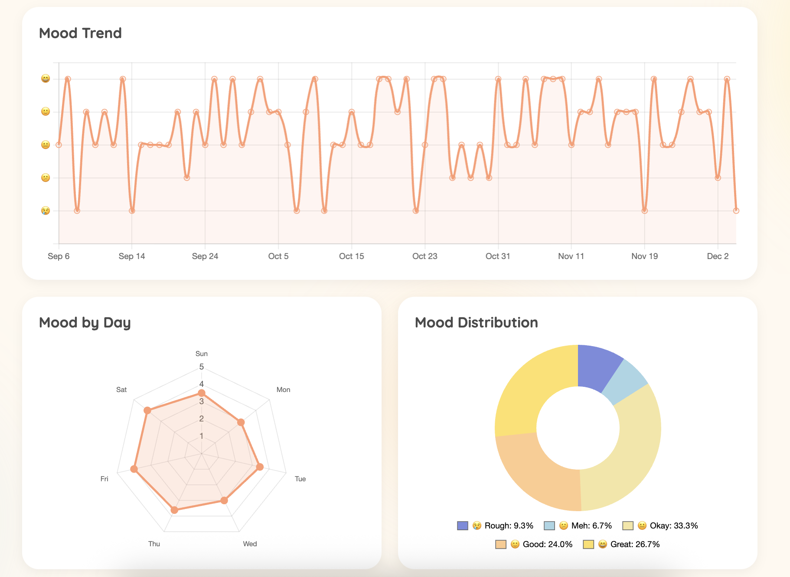
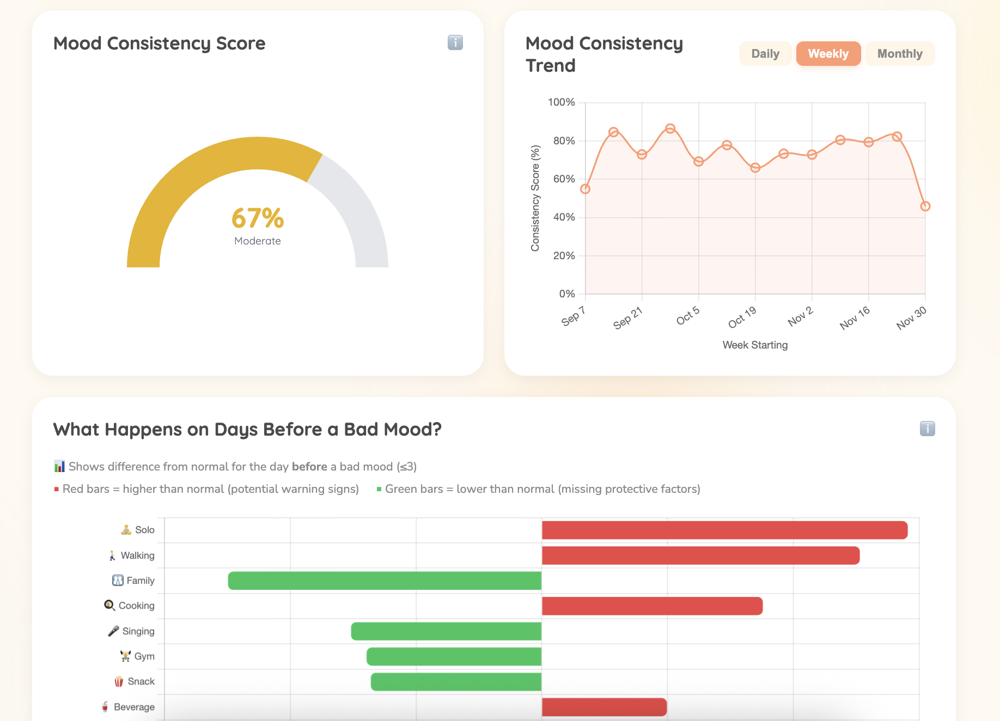
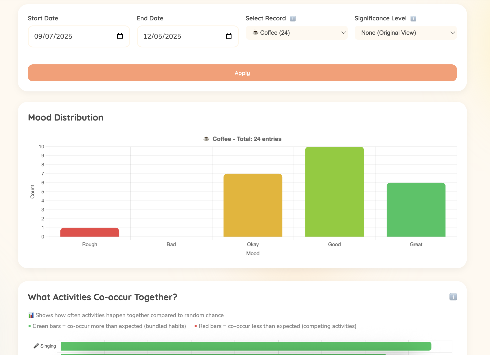
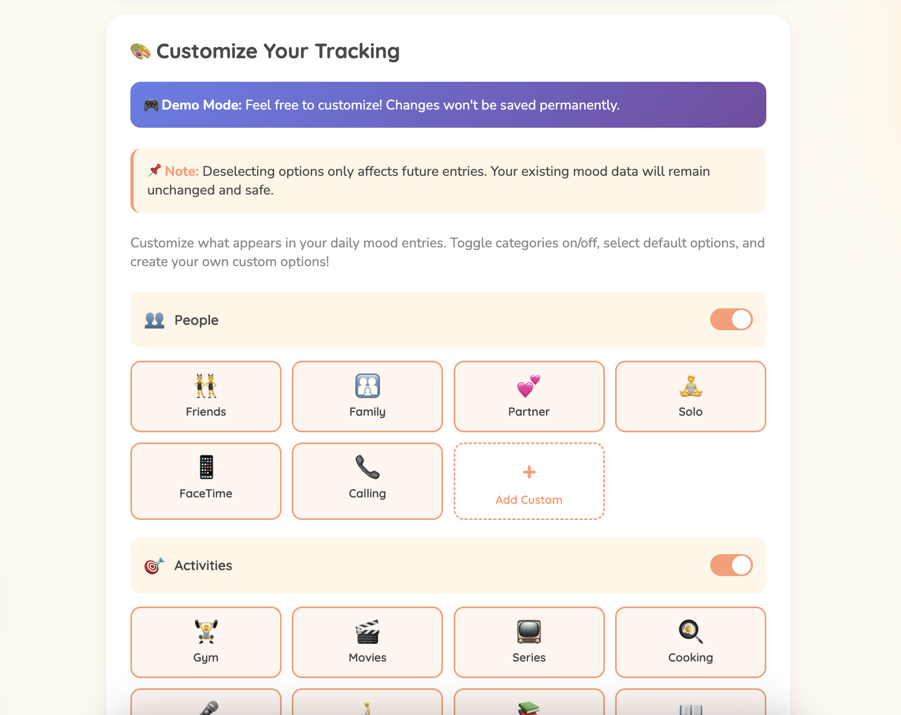
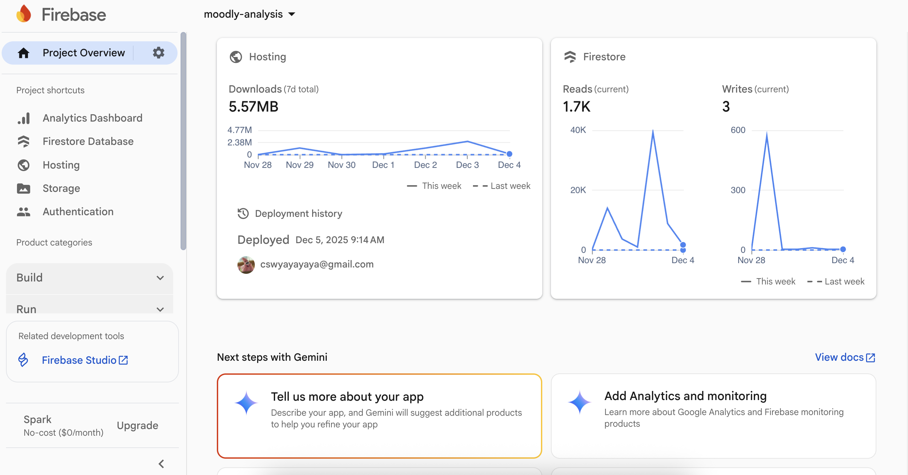

# Moodly Analysis - Personal Mood & Habit Tracker


**🌐 Try the Demo:** [https://moodly-analysis.web.app/](https://moodly-analysis.web.app/)  
*Note: Demo version with limited functionality*

**📧 Get Full Access:** Contact [caslowchien@gmail.com](mailto:caslowchien@gmail.com) to be added as an authorized user (no strings attached!)

---

## 📋 Overview

Moodly Analysis is a personal web application that helps you discover meaningful patterns in your daily life and mood. Unlike typical mood trackers that only provide basic charts, Moodly empowers you to customize tracking factors, perform statistical significance testing, and maintain complete ownership of your data.

### 💡 User Story

> "I want to see if my mood changes based on certain factors like coffee consumption. I also want to define my own tracking factors rather than being limited to what the app provides by default."

Moodly was built to answer these kinds of questions with data-driven insights you can trust.

---

## ✨ Key Features

- ✅ **Fully Customizable Tracking Factors** - Define and track what matters to you
- ✅ **Comprehensive Data Analysis** - Go beyond pretty charts with real insights
- ✅ **Statistical Significance Testing** - Know which patterns are meaningful, not just coincidental
- ✅ **Complete Data Ownership** - Download and interpret your own data anytime
- ✅ **Secure Authentication** - Google Sign-In for protected access
- ✅ **Privacy-Focused** - Your data belongs to you

---

## 🛠️ Technical Stack

**Frontend:**
- HTML5, CSS3, JavaScript
- Responsive web design

**Backend & Infrastructure:**
- Firebase Authentication (Google Sign-In)
- Firebase Realtime Database
- Firebase Hosting

**Analytics:**
- Statistical significance testing
- Custom data analysis algorithms

---

## 📊 Features Walkthrough

### Mood Analysis Views


*Comprehensive mood tracking and pattern visualization*


*Detailed correlations between mood and daily factors*


*Statistical significance testing for data-driven insights*

### Customization Options


*Define your own tracking factors in the Settings section*

Users can create custom factors to track anything relevant to their lives:
- ☕ Coffee intake
- 💤 Sleep quality
- 🏃 Exercise habits
- 📚 Work productivity
- 🎵 Social activities
- And anything else you want to monitor!

---

## 🔒 Security & Data Management


*Secure data storage with Firebase*

### Authentication
- Secure Google Sign-In via Firebase Authentication
- Access restricted to authorized users only
- User whitelist maintained for database protection

### Data Privacy
- Full data ownership - download your complete dataset anytime
- Data stored securely in Firebase Realtime Database
- No third-party data sharing

---

## 🚀 Getting Started

### Using the App (As a User)

1. **Request Access**: Email [caslowchien@gmail.com](mailto:caslowchien@gmail.com) to be added to the authorized users list
2. **Login**: Visit [https://moodly-analysis.web.app/](https://moodly-analysis.web.app/) and sign in with Google
3. **Customize**: Set up your personal tracking factors in Settings
4. **Track**: Log your daily mood and custom factors
5. **Analyze**: Explore patterns and statistical insights in your data

### Running Locally (For Developers)

1. **Clone the repository**
```bash
git clone https://github.com/yourusername/Moodly-Analysis.git
cd Moodly-Analysis
```

2. **Set up Firebase configuration**

Create a `firebase-config.js` file in the root folder:
```javascript
// firebase-config.js
const firebaseConfig = {
  apiKey: "YOUR_API_KEY",
  authDomain: "YOUR_AUTH_DOMAIN",
  databaseURL: "YOUR_DATABASE_URL",
  projectId: "YOUR_PROJECT_ID",
  storageBucket: "YOUR_STORAGE_BUCKET",
  messagingSenderId: "YOUR_MESSAGING_SENDER_ID",
  appId: "YOUR_APP_ID"
};

// Owner UIDs for access control
const OWNER_UIDS = ['your-uid-here'];
```

You can find your Firebase configuration in:
**Firebase Console → Project Settings → General**

3. **Configure User Access**

Update the `OWNER_UIDS` array with authorized user IDs to control who can access the database.

4. **Deploy or Run Locally**

For local development, use a local server:
```bash
# Using Python
python -m http.server 8000

# Using Node.js
npx http-server
```

Then visit `http://localhost:8000` in your browser.

---

## 📈 What Makes Moodly Different?

| Feature | Typical Mood Trackers | Moodly Analysis |
|---------|----------------------|-----------------|
| Custom Factors | ❌ Limited presets | ✅ Fully customizable |
| Statistical Testing | ❌ Just visual charts | ✅ Significance testing |
| Data Ownership | ❌ Locked in app | ✅ Full export & control |
| Analysis Depth | ❌ Surface-level insights | ✅ Deep pattern analysis |
| Privacy | ⚠️ Often shared | ✅ Complete privacy |

---

## 🎯 Use Cases

- **Health & Wellness**: Track how lifestyle factors affect your mood
- **Productivity Optimization**: Identify what helps you perform best
- **Habit Formation**: Understand which habits positively impact your well-being
- **Personal Research**: Conduct your own n=1 experiments
- **Mental Health Awareness**: Recognize patterns and triggers

---

## 🔐 Access Control

To protect Firebase resources and ensure data privacy, the application uses a whitelist-based access control system. Users must be explicitly added to the `OWNER_UIDS` array to use the full version with data storage capabilities.

**To get added to the whitelist:**
- Email: [caslowchien@gmail.com](mailto:caslowchien@gmail.com)
- No cost, no commitments - just genuine interest in using the app!

---

## 🛣️ Roadmap

Potential future enhancements:
- [ ] Advanced machine learning predictions
- [ ] Correlation heatmaps
- [ ] Export to multiple formats (CSV, JSON, PDF reports)
- [ ] Mobile app version
- [ ] Shareable insights (while maintaining privacy)
- [ ] Integration with wearables and health apps

---

## 🤝 Contributing

This is a personal project, but suggestions and feedback are welcome! Feel free to:
- Open issues for bug reports or feature requests
- Share ideas for analysis features
- Provide feedback on user experience

---

## 📝 License

This project is for personal use. Please contact the developer for any commercial or derivative use inquiries.

---

## 📧 Contact

**Developer:** Caslow Chien  
**Email:** [caslowchien@gmail.com](mailto:caslowchien@gmail.com)  

For access requests, questions, or feedback, don't hesitate to reach out!

---

## 🙏 Acknowledgments

Built with:
- Firebase for backend infrastructure
- Google Sign-In for secure authentication
- Passion for data-driven self-improvement

---

**Start tracking your mood with meaning today!** 📊✨
